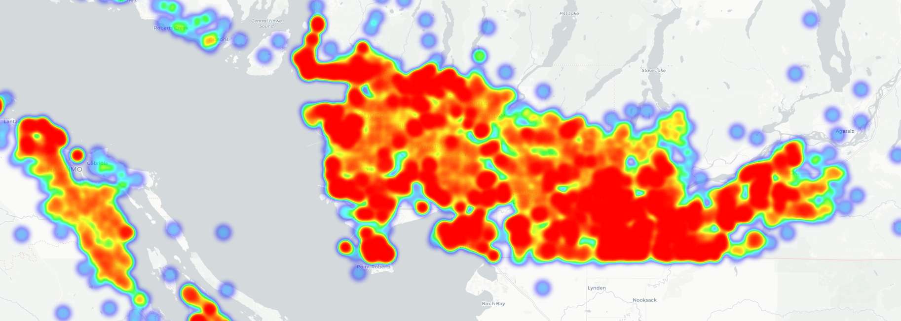
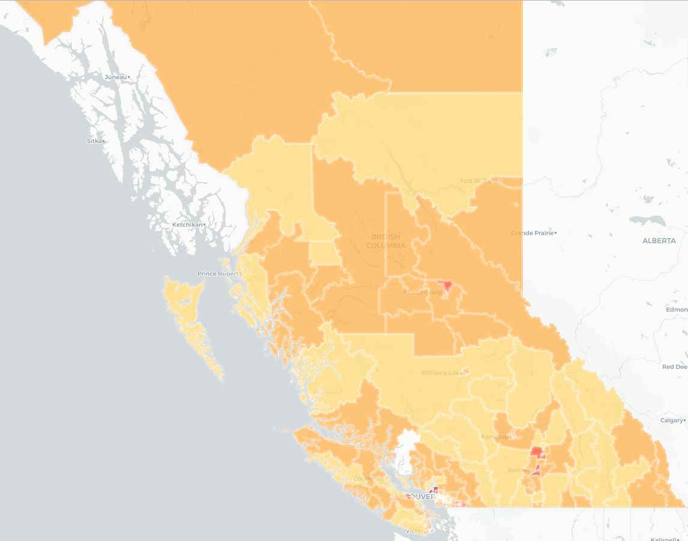

# BC Children's Work
Work I'm doing as a Summer Data Scientist for the BC Children's Hospital Foundation Analytics Team. The goal of the Foundation is to enhance the resources provided to the hospital by the Provincial Governemnt in order to provide better services to children and youth throughout the province. 

The jupyter notebooks are organized as follows:

**1. Cleaning and Geocoding**
  - Cleaning & Aggregating data from different databases at the postal code level 
  - Adding a Lat/Long to each postal code through Google API 
  - Placing each BC postal code within a neighbourhood using shapefiles 
  
**2. EDA and Prediction (Manifold)** 
   - Exploring the dataset relationships (correlation matrix, plotting) 
   - Running prediction analysis on 2016 hospital donations: 
      * `Multivariate Regression` 
      * `Multivariate Regression with PCA regressors`
      * `Random Forest` 
      * `Boosting`
      
**3. Churn (Retention Rates) Analysis (2016/17)**
   - EDA 
   - Classification of individuals by rentention rates
   - Deployment of model to Microsoft Azure

**3. Visualizations**
  - Heatmap and Chloropleth for donation + demographic data accross BC ; blueprint for dashboard created using javascript + D3

