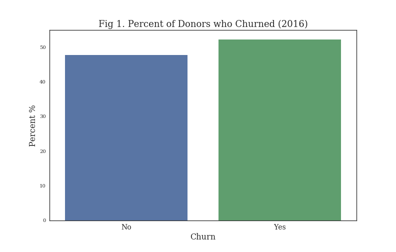

# BC Children's Work

Work I'm doing as a Summer Data Scientist for the BC Children's Hospital Foundation Analytics Team. The goal of the Foundation is to enhance the resources provided to the hospital by the provincial government in order to deliver the best care available to children and youth throughout the province. 

The jupyter notebooks are organized as follows:

**1. Cleaning and Geocoding**
  - Cleaning & Aggregating data from different databases at the postal code level 
  - Adding a Lat/Long to each postal code through Google API 
  - Placing each BC postal code within a neighbourhood using shapefiles 
  
**2. EDA and Prediction (Manifold)** 
   - Exploring the dataset relationships (correlation matrix, plotting). 
   - Running prediction analysis on 2016 hospital donations: 
      * `Multivariate Regression` 
      * `Multivariate Regression with PCA regressors`
      * `Random Forest` 
      * `Boosting`

**3. Churn (Retention Rates) Analysis (2016/17)**
   - Exploring the dataset relationships (Recency, Frequency and Monetary Value). 
          
   - Classifying individuals by rentention rates: 
      * `Logistic Regression` 
      * `Random Forest`
      * `Boosted Decision Trees`
   - Feature Importance    
          
   - Deployment of model to Microsoft Azure in order to predict rates for 2018

**3. Visualizations**
  - Heatmap and Chloropleth for donation + demographic data accross BC ; blueprint for dashboard created using javascript + D3

